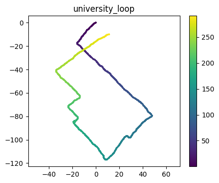

# RoNIN-based PDR for SensorLogger

<p>
  
</p>

This fork modifies [RoNIN](https://github.com/Sachini/ronin) to be used with data (`acc`, `gyro`, `rotvec`) collected with [SensorLogger](https://www.tszheichoi.com/sensorlogger) data collection app ([Android](https://play.google.com/store/apps/details?id=com.kelvin.sensorapp[) and [iOS](https://apps.apple.com/us/app/sensor-logger/id1531582925)). The fork's main purpose is to offer an easy RoNIN-based PDR algorithm for researchers and developers, as I found it to be surprisingly hard to find robust and working PDR options freely available. Or better yet, usable out of the box.

The compatibility is achieved by hacking RoNIN (ridi execution path) internals step by step, removing blocking dependencies on ground truth and calibration data.

## Setup
1. Clone this fork
2. Download a pre-trained RoNIN model you want to use (from [here](https://doi.org/10.20383/102.0543)). The fork is tested with `ronin_resnet/checkpoint_gsn_latest.pt`.
3. Create virtual environment, activate, and install dependencies (or run globally)
```
python -m venv .venv
source .venv/bin/activate
python -m pip install -r requirements.txt
```

## Usage
Example notebook at `sensorlogger_to_pdr/example.ipynb` demonstrates basic usage.

Command line:
```
python ./sensorlogger/sensorlogger_to_pdr.py --path <sensor_logger_data> --ronin_path <ronin_path> --model_path <ronin_model_path>
```
Example:
```
python ./sensorlogger/sensorlogger_to_pdr.py --path /ronin_for_sensorlogger/sensorlogger/example_data/shopping_mall_eight --ronin_path "/ronin_for_sensorlogger/" --model_path /ronin_for_sensorlogger/models/ronin_resnet/checkpoint_gsn_latest.pt
```

## Sensor and data requirements
The modified RoNIN algorithm requires the following sensor data files
  * `Gyroscope.csv`
  * `Orientation.csv`
  * `TotalAcceleration.csv`

Using other data collection applications should be straightforward by just converting to SensorLogger format or converting directly to the pickle RoNIN requires.

### Gyroscope.csv format:
```
time,seconds_elapsed,z,y,x
1718030736872695300,0.0706953125,-0.32157647609710693,0.15512901544570923,0.6729803085327148
```

### Orientation.csv format:
```
time,seconds_elapsed,qz,qy,qx,qw,roll,pitch,yaw
1718030736912338000,0.110337890625,-0.49317896366119385,-0.10824661701917648,0.21374563872814178,0.8362834453582764,0.033629775047302246,-0.4828145205974579,1.0739439725875854
```
NOTE: roll, pitch, and yaw are not required by RoNIN

### TotalAcceleration.csv format:
```
time,seconds_elapsed,z,y,x
1716979893874983200,0.047983154296875,9.851848602294922,1.407876968383789,-0.008374879136681557
```

## Notes:
The fork was originally hacked under a timeline for [research purposes](https://arxiv.org/abs/2409.01242). The functionality has not been fully tested, but the fork seems to work over different phone models and manufacturers (OnePlus, iPhone). Fixes and suggestions are welcome.

## Original README:
# RoNIN: Robust Neural Inertial Navigation in the Wild

**Paper**: [ICRA 2020](https://ieeexplore.ieee.org/abstract/document/9196860), [arXiv](https://arxiv.org/abs/1905.12853)  
**Website**: http://ronin.cs.sfu.ca/  
**Demo**: https://youtu.be/JkL3O9jFYrE

---
### Requirements
python3, numpy, scipy, pandas, h5py, numpy-quaternion, matplotlib, torch, torchvision, tensorboardX, numba, plyfile, 
tqdm, scikit-learn

### Data 
The dataset used by this project is collected using an [App for Google Tango Device](https://drive.google.com/file/d/1xJHZ_O-uDSJdESJhZ3Kpy86kWaGX9K2g/view) and an [App for any Android Device](https://drive.google.com/file/d/1BVhfKE6FEL9YRO1WQCoRPgLtVixDbHMt/view), and pre_processed to the data format specified [here](https://ronin.cs.sfu.ca/README.txt) 
Please refer to our paper for more details on data collection.

You can download the RoNIN dataset from our [project website](http://ronin.cs.sfu.ca/) or [HERE](https://doi.org/10.20383/102.0543). Unfortunately, due to security concerns we were unable to publish 50% of our dataset.

Optionally, you can write a custom dataloader (E.g: soure/data_ridi.py) to load a different dataset.

### Usage:
1. Clone the repository.
2. (Optional) Download the dataset and the pre-trained models<sup>1</sup> from [HERE](https://doi.org/10.20383/102.0543). 
3. Position Networks 
    1. To train/test **RoNIN ResNet** model:
        * run ```source/ronin_resnet.py``` with mode argument. Please refer to the source code for the full list of command 
        line arguments. 
        * Example training command: ```python ronin_resnet.py --mode train --train_list <path-to-train-list> --root_dir 
        <path-to-dataset-folder> --out_dir <path-to-output-folder>```.
        * Example testing command: ```python ronin_resnet.py --mode test --test_list <path-to-train-list> --root_dir 
        <path-to-dataset-folder> --out_dir <path-to-output-folder> --model_path <path-to-model-checkpoint>```.
    2. To train/test **RoNIN LSTM** or **RoNIN TCN** model:
        * run ```source/ronin_lstm_tcn.py``` with mode (train/test) and model type. Please refer to the source code for the 
        full list of command line arguments. Optionally you can specify a configuration file such as ```config/temporal_model_defaults.json``` with the data
         paths.
        * Example training command: ```python ronin_lstm_tcn.py train --type tcn --config <path-to-your-config-file> 
        --out_dir <path-to-output-folder> --use_scheduler```.
        * Example testing command: ```python ronin_lstm_tcn.py test --type tcn --test_list <path-to-test-list> 
        --data_dir <path-to-dataset-folder> --out_dir <path-to-output-folder> --model_path <path-to-model-checkpoint>```.
4. Heading Network
    * run ```source/ronin_body_heading.py``` with mode (train/test). Please refer to the source code 
    for the full list of command line arguments. Optionally you can specify a configuration file such as 
    ```config/heading_model_defaults.json``` with the data paths.
    * Example training command: ```python ronin_body_heading.py train --config <path-to-your-config-file> 
    --out_dir <path-to-output-folder> --weights 1.0,0.2```.
    * Example testing command: ```python ronin_body_heading.py test --config <path-to-your-config-file> 
    --test_list <path-to-test-list>  --out_dir <path-to-output-folder> --model_path <path-to-model-checkpoint>```.

<sup>1</sup> The models are trained on the entire dataset

### Citation
Please cite the following paper is you use the code, paper or data:  
[Herath, S., Yan, H. and Furukawa, Y., 2020, May. RoNIN: Robust Neural Inertial Navigation in the Wild: Benchmark, Evaluations, & New Methods. In 2020 IEEE International Conference on Robotics and Automation (ICRA) (pp. 3146-3152). IEEE.](https://ieeexplore.ieee.org/abstract/document/9196860)
